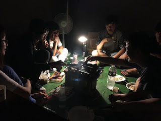
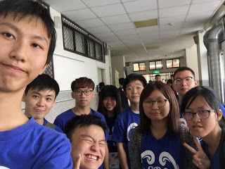
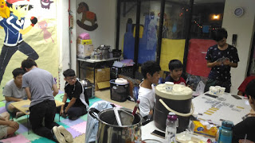
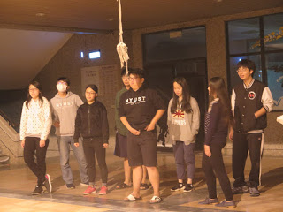
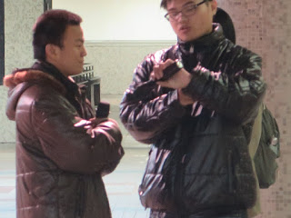
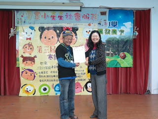

# 2017/05/23
# 大三幹部上學期心得

<table  cellspacing="0" cellpadding="0">
<tr>
<td width="450"></td>
<td width="450" valign="middle">從來沒想過大學生涯會接社團幹部，因為之前前女友的關係，我很排斥社團，對社團有打從心底上的厭惡。我的好朋友，是我的學弟，也是我的好麻吉4N，找不到人當幹部，苦苦拜託我，我心軟 義氣相挺他，答應他接下學膳會活動長這個重大的職位，也帶來了我大三豐富及酸甜苦樂的體驗</td>
</tr>

<tr>
<td width="450" valign="middle">因為社團幹部大部分都是空降，不然就是彼此根本不熟悉。一開始大家都滿安靜的，互相都彬彬有禮，講白的就是陌生人的感覺。經過幹訓、新血招募、全校迎新、社團博覽會，大家慢慢地熟悉，漸漸了變成了無話不談的好友。我很感謝社團的每一個人那時候的付出，4N對外的喇賽，讓我們很安心應對新生，搜嘎、yee婷和棠的細心，井然有序地完成每一件事，糞哥和貢丸的搞笑2人組帶來了許多有趣的事，俊霖靦腆的對著我們笑，又不失一份文靜，
</td>
<td width="450"></td>
</tr>

<tr><td colspan="2">只是總是會發生的摩擦，總務(棠)她覺得我們幹部太廢，我們總是出了很多雷包鳥事，她漸漸地對我們失去了社團的感情，我想要努力把她拉回來，只是不管我怎麼做，她都不願意回頭，我心中留下遺憾，為甚麼我不再努力一點把她拉回來呢？那時候我喜歡她，她也清楚明白，可是愛情是強求不來的，打槍+2</td></tr>

<tr>
<td width="450"></td>
<td width="450" valign="middle">經過了社內迎新、健康講座、社遊，社團新生漸漸融入社團裡面，舉辦多次的社課、宵夜團，讓我們之前的感情越來越好，但是我的心也累了...我也慢慢失去對社團的感情。在社團裡只有淪落工具人的命，從來沒有人能體貼我大三的課業壓力，沒有人能感受到我心中的淒涼悲意...</td>
</tr>

<tr><td colspan="2">到了籌備寒假營隊，因為我們的總召與社團指導老師間的不愉快，同時也跟我們幹部之間有了間隙，因此決定臨時換掉寒假營隊總召，那時候沒有人願意接也不想承擔這個擔子。那時候，我腦衝，想說既然付出了那麼多，什麼也得不到，那我何不入地獄？我就接下了這個責任。</td></tr>

<tr>
<td width="450"></td>
<td width="450" valign="middle">因為上任總召沒有把企劃書、服學報告處理好，所以讓我忙得一頭腦熱，壓力也隨之越來越大，開始抽菸，藉著菸來消除我的煩惱、壓力及哀愁。我的專題，同時也犧牲掉，讓我的同學對我有了意見。成績原本已經很不好了，現在更是直線往下掉，面臨21的危機。4N忙著跟搜嘎談戀愛

總務因為對社團有意見也不願意參加寒假營隊來幫忙

糞哥有兩邊社團 系會 學膳來回跑也忙不過來

俊霖也要弄他設計系上的作業</td>
</tr>

<tr>
<td width="450" valign="middle">我真的真的那時候好無助，沒有人能願意傾聽我的心事。那時候出現了學妹，會跟我聊天，關心我，講些智障有趣的事給我笑，幾乎好幾天都半夜講電話講到快天亮。那時候我一直以為我的春天來了，我的動力、我的意志也隨之慢慢地起來，很多人慫恿我跟她在一起。告白的前一天我失眠，心理難免有點恐懼被像之前被打槍，但是我不斷地告訴我自己，要相信自己，即便被打槍了，但是也不要讓自己留下後悔、悔恨。
</td>
<td width="450"></td>
</tr>

<tr><td colspan="2">

結果 .... 還是又被打槍了 哀.... 感覺我的心又再次支離破碎，但是我身上還有寒假營隊這個重任，我不能倒下，我要堅強起來。我讓自己不要想那麼多，想要讓自己更加地投入籌備活動。打槍+3  

但...我的厄運並沒有因此結束，我發現到學妹跟學弟走得很近，不管做什麼事都黏在一起，而且都跑來彙辦拿睡袋睡在一起，那時候我就猜得出來了，我的理智完全崩潰，我人生第一次喝了1罐高粱，發酒瘋。吐得滿地都是，倒在地上痛哭，想到我前女友的事、對以前告白的女生的事、做過無可挽回的事，我的人生怎麼那麼悲慘，工具人什麼都得不到。
 
經過瘋狂的那天，大家也發現到我的心情，但是其實我感受不到別人對我有甚麼改變，還是一樣，而且有些人對我還有異樣的眼光及偏見。那時候我發誓，不管在怎麼痛苦，也要好好的埋藏在自己心裡，臉上戴上那虛偽的面具。

 
 
到了籌備期，營隊的事越來越麻煩，越來越多要思考怎麼解決問題，每天籌備到1、2點，我為了不要在次發生像上次營隊的悲劇，盡量讓新生多點時間休息，但是引起了上屆幹部的不滿，讓上屆幹部誤會了我，原本是不錯的關係，但是因為籌備晚會過程中，上屆幹部干預，沒有尊重別人的亂兇人，而且也從來沒有回來社團看過，讓新生每個人的臉色都很難看，我先請上屆幹部先到旁邊休息不要干預他們討論，結果她以為我是叫她滾，從此之後她就很討厭我，還po在ig上公審我罵我，我還能說甚麼呢？
 
 

心理的負擔越來越大，也看著學弟學妹的親密，我已經不知道我當時到底怎麼度過那段籌備期間，大概就一直抽菸，忘記這一切吧？

 

營隊晚會結束之後 感性時間，好多人放著閃光，心裡滿滿的羨慕，同時學妹跟學弟之間感情也在此公開告白，雖然已經知道，但是心還是碎了滿地都是，不斷地告訴自己要忍耐
 
 

終於到了寒假營隊結尾，中間出了很多包，像是器材未備齊、跑流未確實、講稿沒RE過、場地沒規劃好....等 各種鳥事

好在大家幹部有力的出力 有車的出車 有錢的出錢，讓我們這個寒假營隊 免強的順順利利結束

我也很感謝媽媽來幫我寒假營隊的忙，也感謝上任總召喇叭花的提醒我有什麼事還沒做，最後真的非常非常感謝每個人都付出，

</td></tr>

<tr><td colspan="2"></td></tr>
<tr><td>雖然我的人悲劇，但是我還是很愛著你們學膳會的每一份子</td></tr>
</table>

* * *

# Like Button

<iframe class="lc-margin-top-64 lc-margin-bottom-32 lc-mobile" data-v-b66e9a5a="" frameborder="0" src="https://button.like.co/in/embed/s9443112/button"> </iframe>

* * *


  
