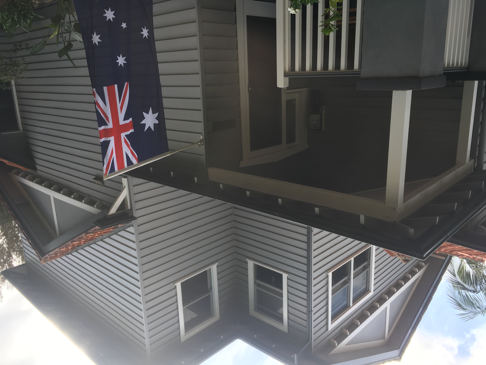
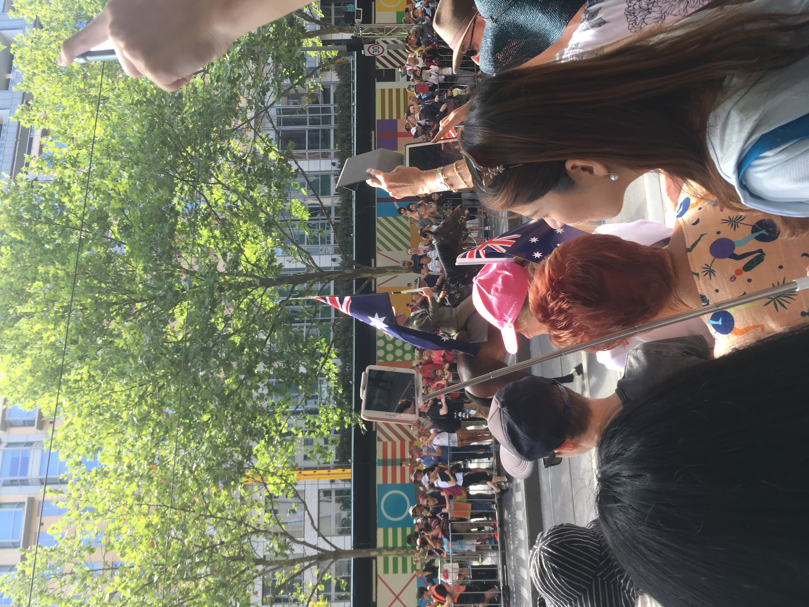
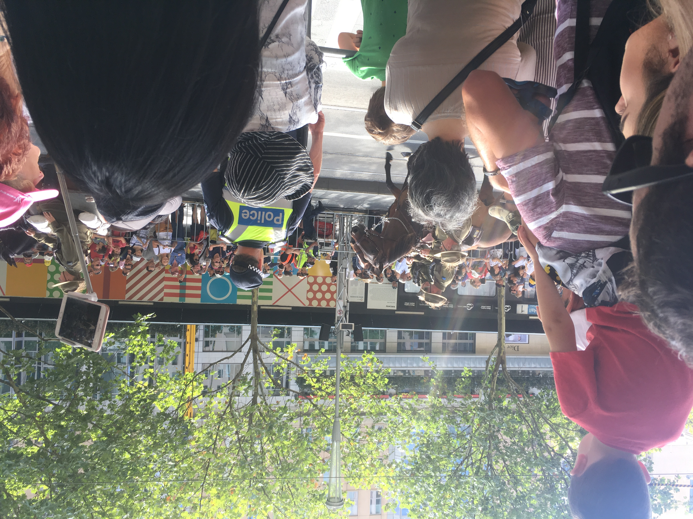

# 2019/01/26
# Australia day

>Australia day
一個人 自己出來看澳洲街上遊行
有很多國家舉著自己國家的國旗遊行
意識到 台灣好弱勢 中國好強勢
大家都把台灣當成中國的
我討厭中國人
但是我在這邊很多時候也是請中國人幫忙
我很矛盾 我到底是誰?

好不容易有了新的朋友
但是走的走 去的去
有問題的有問題
到頭來我還是一個人
雖然現在跟臭婊子們不同班級 遇到新的同學
但是 她們是臭婊子們的朋友
所以 還是婊子 鄵

* * *

# Like Button

<iframe class="lc-margin-top-64 lc-margin-bottom-32 lc-mobile" data-v-b66e9a5a="" frameborder="0" src="https://button.like.co/in/embed/s9443112/button"> </iframe>

* * *


  
