# 2019/02/20
# Mansfield Day1

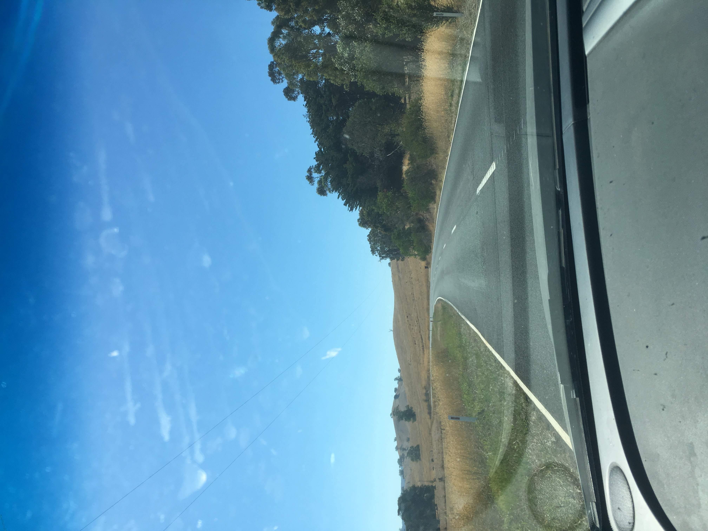

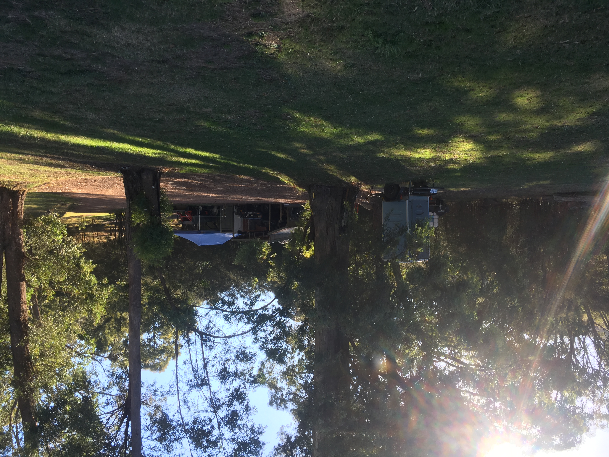

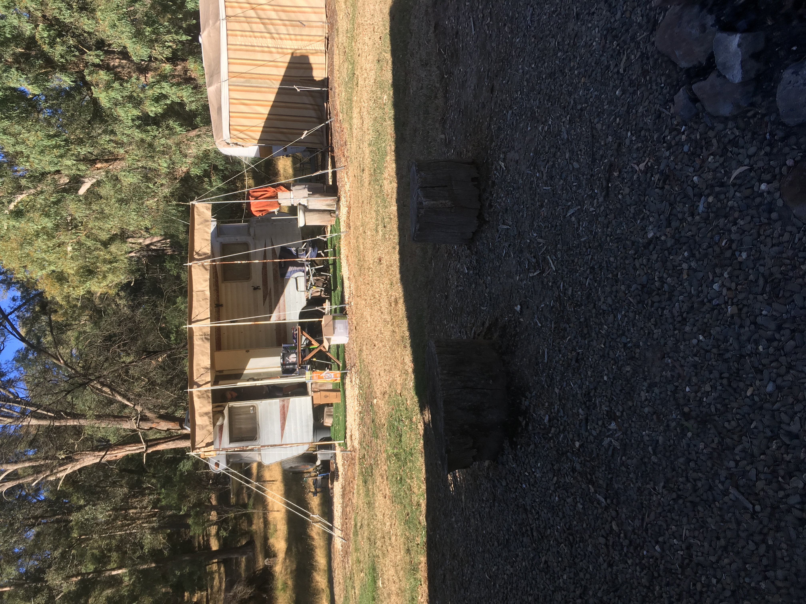
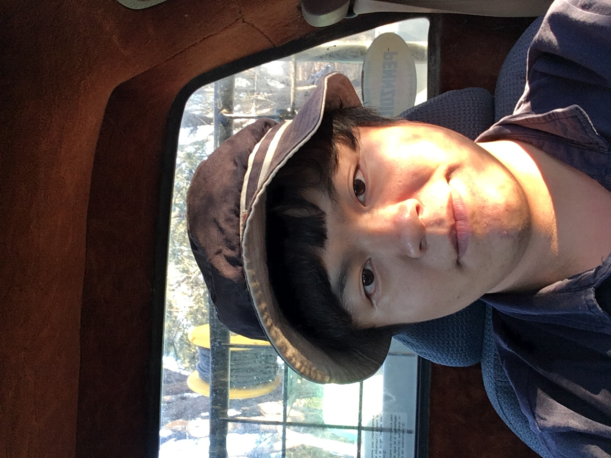
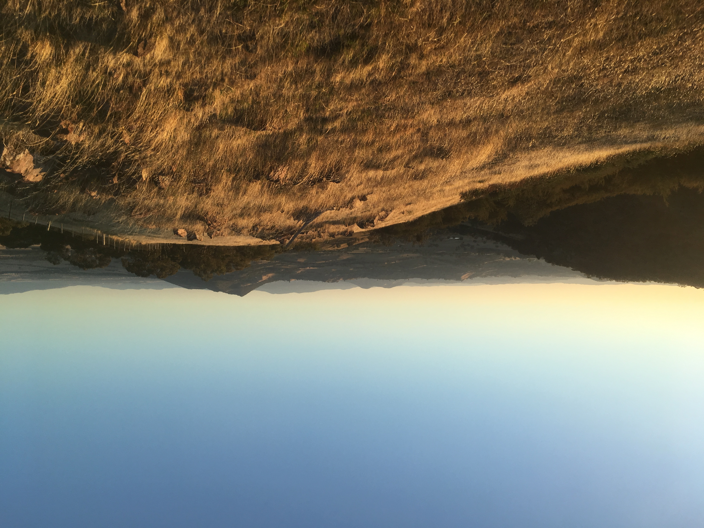
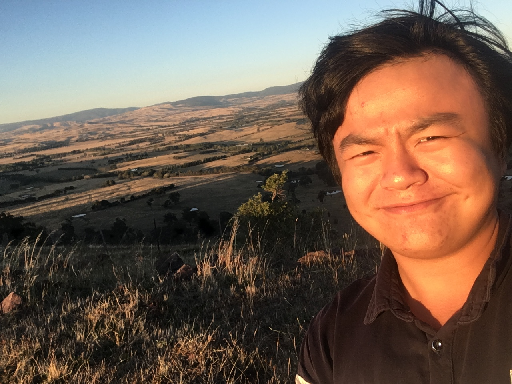
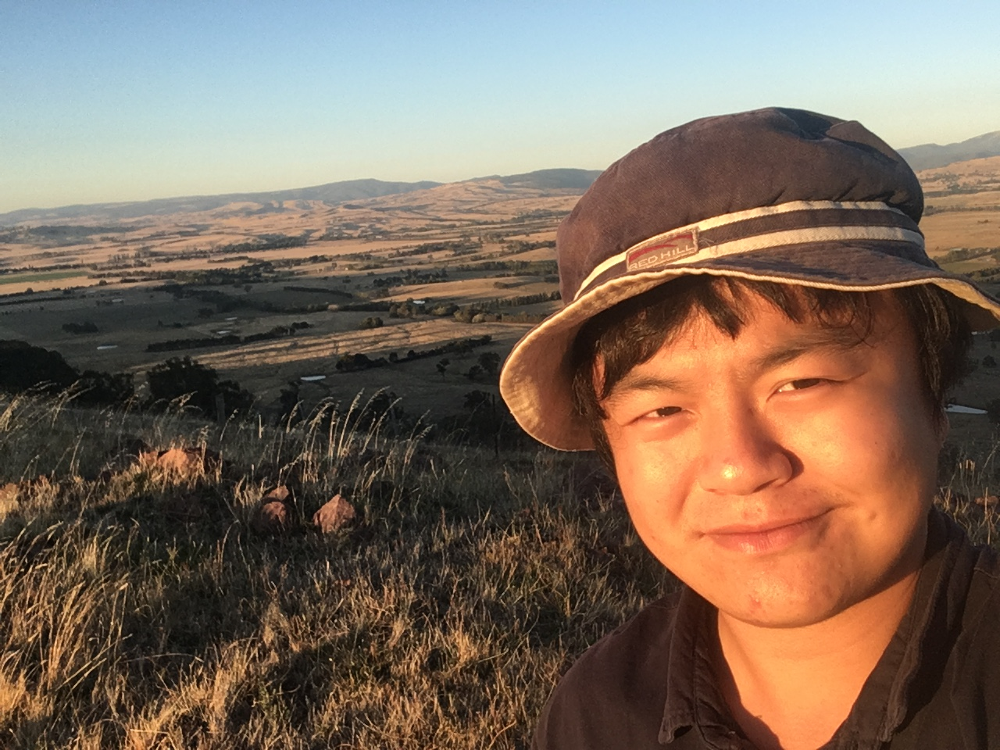

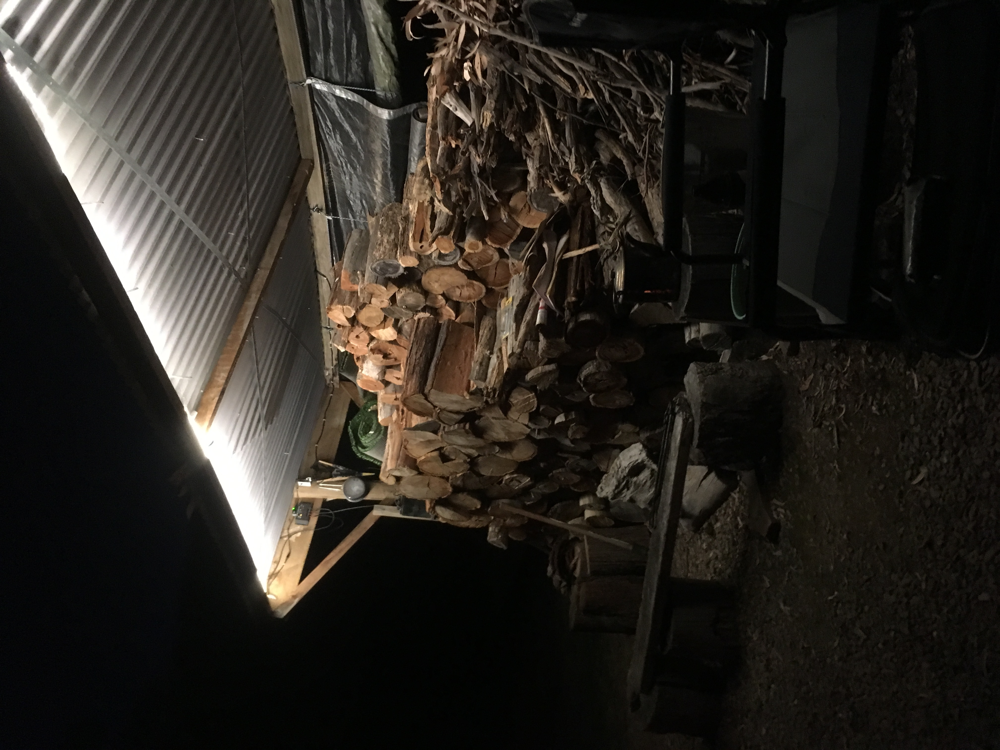
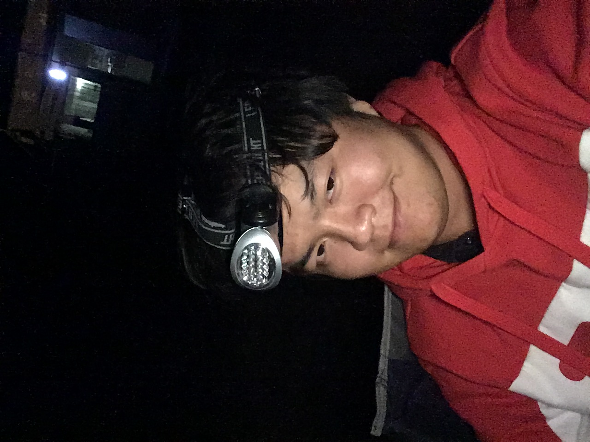
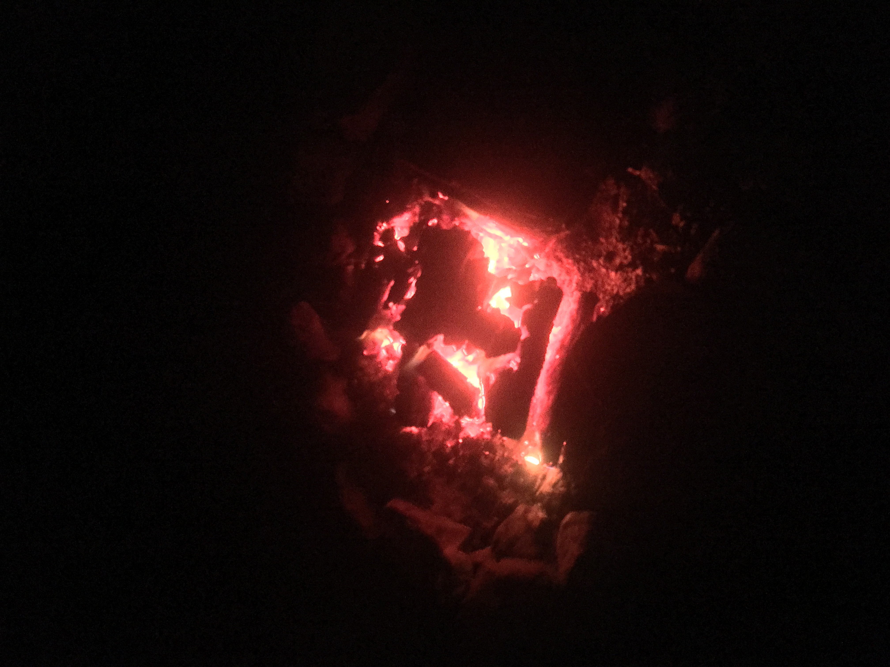
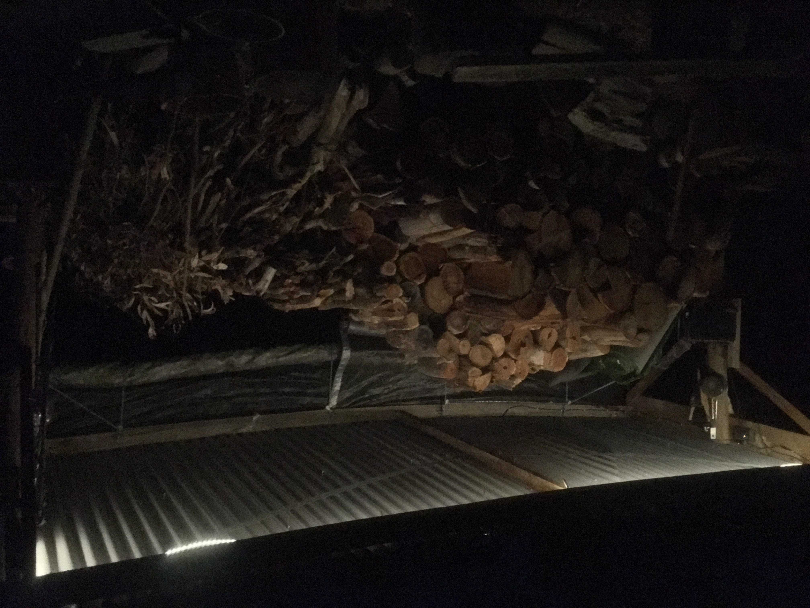

  2019/02/20 禮拜三
  下午跟著Homepa 坐著他的車
  從Melbourne到Mansfield去生活四天三夜
  旅途大概是3個小時, 但中途有繞道去Lilydale購買補給品順便看一下風景
  從高樓大廈到郊區住宅, 到野外森林再到一望無際的草原小丘
  澳洲的鄉村地區風景真的很漂亮, 沒有城市裡的紛紛擾擾

  到了他的農場之後 傻眼了
  根本沒有屋子 只有露營車和工具儲藏室以及一堆乾燥的樹枝木頭
  真的不愧是狗不拉屎 鳥不生蛋的鬼地方= _ =

  整理了一下行李後
  Homepa開著他的老爺小貨車帶著我上去山上
  去看野生的動物
  但是很不怎麼幸運的 天氣太熱
  只有兩三隻袋鼠和鹿
  
  開車到在山頂上,望著夕陽下山
  Homepa說: 這是他的世界之巔
  我也感受到那股 "觀泰山而小天下" 的氣魄

* * *

# Like Button

<iframe class="lc-margin-top-64 lc-margin-bottom-32 lc-mobile" data-v-b66e9a5a="" frameborder="0" src="https://button.like.co/in/embed/s9443112/button"> </iframe>

* * *


  
