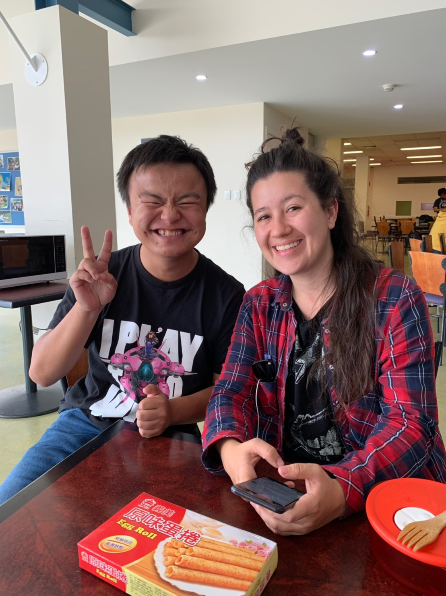

# 2019/03/29
# The Gift was given by Jane

## Jane

今天跟Maria Tram和Jane去喝咖啡 
去學校附近的Kooyong station 
聊完結束了回去學校

Jane她送了我一條 Thai Loin Cloth當作送別禮 
心裡滿感動的 但也滿難過的 
也許今天是我跟她的最後一次見面 
心裡有好多話還沒跟她說 
我也什麼都沒做 只能默默地目送著她離開

等她離開後2,3分鐘 我一直沉浸在我自己的世界裡 
突然心裡有股衝動 
凡正都要結束了，倒不如現在衝過去公車站去找她 
我立馬站起身子，用全身的力量衝向校門口 
但我到的時候，她已經離開了 
我只能在公車站前傻笑 
笑著自己的傻  
笑著自己的懦弱無能

但我不想就此放棄  
至少 至少 我該把我心裡的話告訴她 
我這個人可以悲劇 可以可憐 
但我絕對不要留下任何遺憾

雖然最後 她還是發我好人卡啦 =_=

## Man's 

晚上跟First他們去CBD喝酒 
我把Jane送給我的禮物給他看 
他說這個東西很醜不好看 
當下我心裡很不開心，這是"她"送給我的 
你不要踐踏別人的心意 
當下First也意識到 我臉色不對 趕緊跟我道歉

喝完酒後 其他的人說要不要最後的哈草 
我想說好吧 最後一次跟大家 
我不要哈就好了 我旁邊抽菸就好 
可是他們跑到市中心的公園== 
我當下真的怕死 
想著說  
幹 我明天的班機 都最後一天了 
別讓我在今天完蛋
* * *

# Like Button

<iframe class="lc-margin-top-64 lc-margin-bottom-32 lc-mobile" data-v-b66e9a5a="" frameborder="0" src="https://button.like.co/in/embed/s9443112/button"> </iframe>

* * *


  
