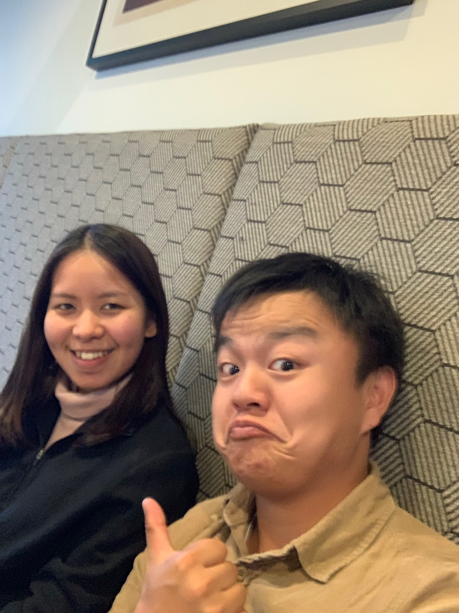

# 2019/03/30
# The last day in Melbourne with Jane

>The last day in Melbourne with Jane

今天早上收拾完行李，打掃完房間後 
就趕快出門去把秤重計給我二姊 
坐好遠的車到Blackburn 
回去的時候心裡很掙扎 
好想再見她一面

對Jane撒了一個善意的謊言 
打電話給她說 剛好有東西要給你 
很怕她會不會覺得我很奇怪 
但我也不管那麼多了~_~

當下見到Jane的時候超級開心，感覺心裡都百花盛開  
但是我這個真的是木頭，也不知道跟她說什麼 
只會講一些基本的話語 
才短短的講不到幾句話，就自己說差不多要走了 
走的時候好落寞。 

想著 
唉...真的結束這回合了

坐上Tram的時候心裡很鬱悶 
想著早就知道不要見面還比較好 
人家根本就對你沒感覺 
只不過是你自作多情 
乖乖當可悲台男吧 品皜 

回到家後坐在庭院中點起一根菸 
想著在澳洲的生活

突然電話響了 是她 
她問我說要不要喝個咖啡後再走 
這個時間很尷尬 
因為在我們家附近(Glen Iris)咖啡廳都關門了，而且我是六點的車子 
這樣我肯定會來不及

我跟她說完我的困難之處後 
她說 好吧 那還是算了 
腦袋一片空白 
一個聲音從我腦海裡傳來

李品皜! 腦殘一次就算了! 人家還在給你一次機會! 你還敢繼續腦殘阿! 

我立馬打電話給機場司機說 
可不可以更改時間，拜託司機讓我更改 
我又馬上再回電給Jane說  
走吧我們出來喝個咖啡聊個天 

我們來到了Glenferria 
隨便找個咖啡廳坐下來喝個咖啡聊天 
聊天的時候看著Jane的時候 
她的臉色其實還是病懨懨的 
我就會想著說我這個真糟糕 
不應該找她出來的，她還那麼不舒服 

我好像都是講一些很無聊的話題 
我真是個木頭 =_=.....

最後在Tram離別的時候 
其實是很想再擁抱她一次的 
但 我怕太多事情了 
只能默默地目送她離開

心底只能不斷安慰自己 
已經結束了 你該知足了

* * *

# Like Button

<iframe class="lc-margin-top-64 lc-margin-bottom-32 lc-mobile" data-v-b66e9a5a="" frameborder="0" src="https://button.like.co/in/embed/s9443112/button"> </iframe>

* * *


  
