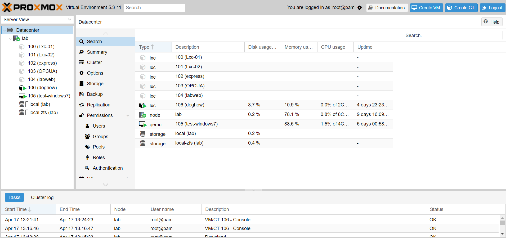
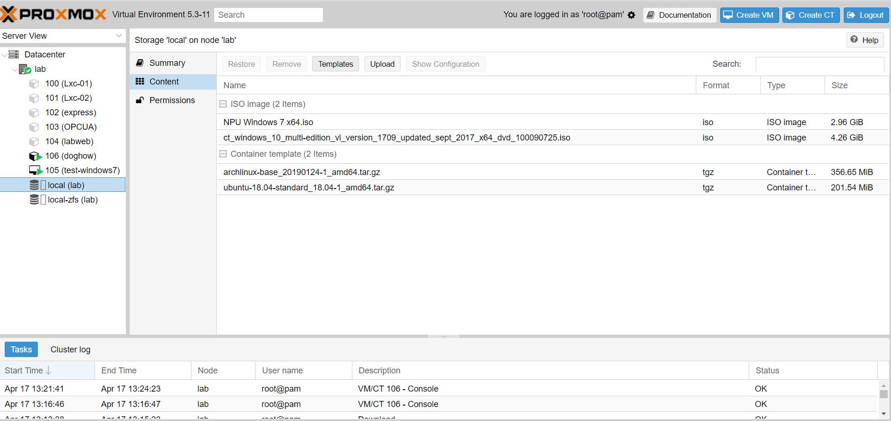

# Proxmox
# Base oprating way

## 新增Templates
來到Proxmox主頁後，點選local Storage

點選該頁面的Content，即可看到Templates，如果要上傳local的iso還是由網路自己下載，就分別點選"Upload" & "Templates"按鈕

* * *

# Like Button

<iframe class="lc-margin-top-64 lc-margin-bottom-32 lc-mobile" data-v-b66e9a5a="" frameborder="0" src="https://button.like.co/in/embed/s9443112/button"> </iframe>

* * *


  

